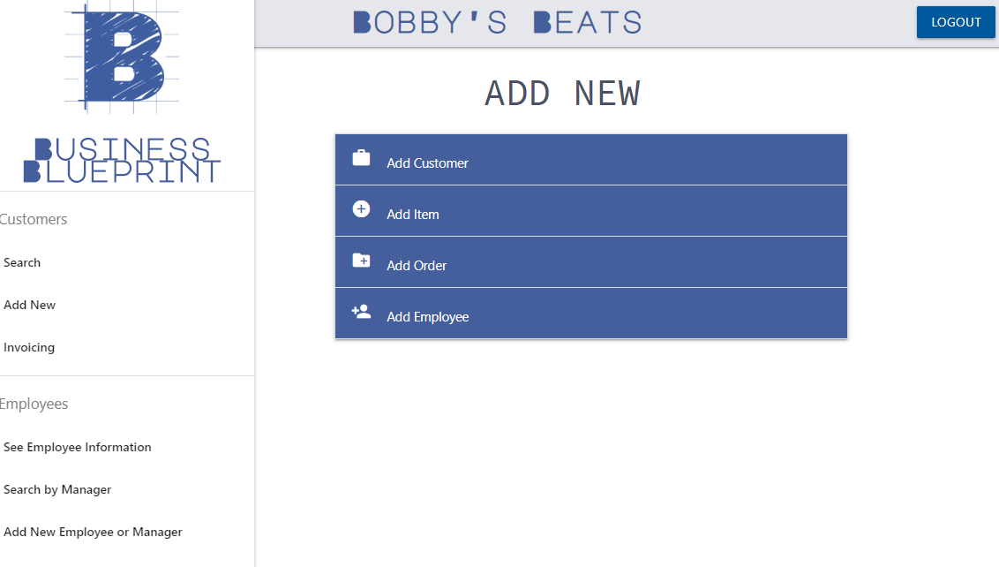
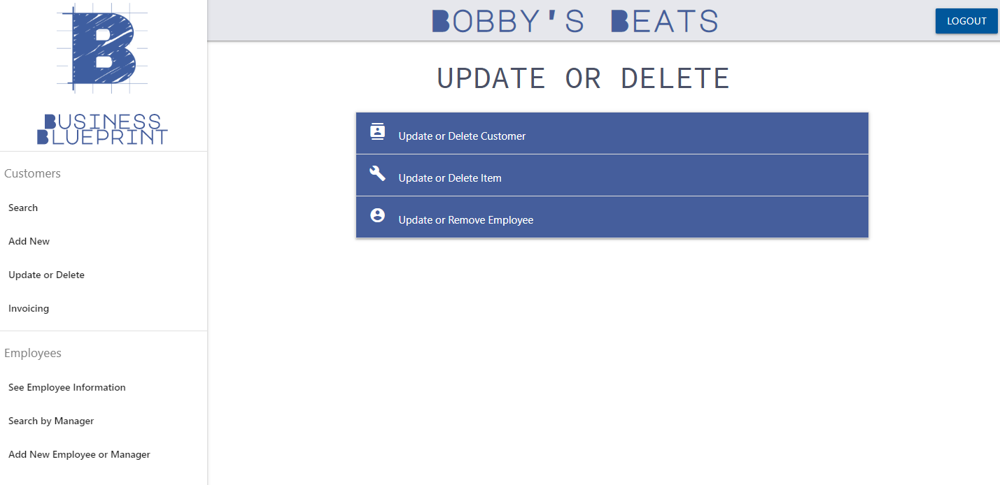
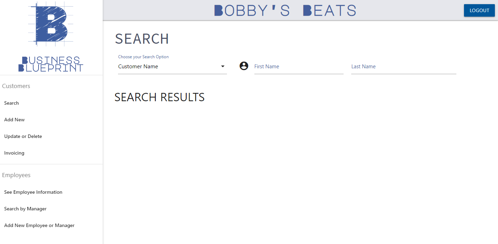

# Business Blueprint

Business Blueprint allows any small business to keep track of their day to day operations

## Utilization

This application will allow a business owner to:
- Add customers to their database
- Add inventory items to their database
- Create and keep track of customer invoices and sales
- Search for invoices, sales orders, customer and employee information

## Technologies Used

- Node.js
- Express Web Server
- MySQL Database
- Sequelize ORM
- Auth0

## Deployment

- https://github.com/lalliere/project-2
- https://bcs-project-2.herokuapp.com/

## Preview

## Future Developement

We would like to add the following features in the future:
- The ability to manage all employee information, schedules, and payroll
- Automatically notify any customer who is late on a payment
- Make the application as mobile friendly as possible

## Acknowledgments

* Cheers to Michael FearsNothing and DJ Bobby Beats for all of their expertise and help